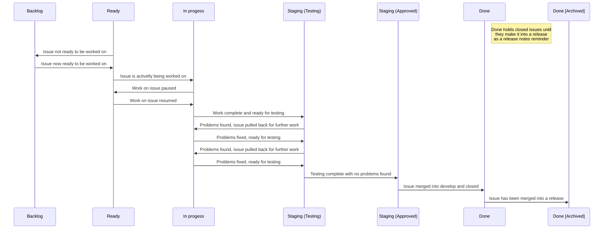

# GitHub Work-Flow

## Code change life-cycle

Any and every code change should go through the following stages:

### Create a GitHub issue

Before any work is done, an GitHub issue describing the problem being solved needs to be created. The GitHub issue serves as a singular repository for everything related to the assignment and as such it needs to contain:

- A clearly identifiable title briefly describing the heart of the issue
- A detailed description and motivation behind the change being made
- Links to any relevant outside resources
- Labels describing type of issue and teams assigned (see [Labeling](#labeling))
- Assignment of users who will work on the issue
- Assignment of a project and/or milestone when relevant

If, when creating an issue, you're presented with an issue template, don't deviate from the template!

During the life of an issue, the issue will:

- Accumulate comments with all additional resources, conclusions, changes of scope or similar
- Automatically accumulate references to all commits to the issue branch - see [Commit messages](git.md#commit-messages)

Issues **ARE** meant to track what needs to be done, and contain all the resources needed to fully describe what needs to be done.

Issues **ARE NOT** meant to track or discus implementation details or progress (see [Create a pull request](#create-a-pull-request)).

Issues **ARE NOT** chat rooms and issue comments aren't instant messages - every comment needs to be detailed and relevant! If you need to ask a quick question or throw out a quick comment, use other means and then after, if relevant, write down the answer/conclusion under the issue.

**When "GitHub Projects" is being used**, a newly created issue should be added to relevant project(s) into which ever column makes sense for that particular "GitHub Projects" board. (See example board [here](https://github.com/ofzza/kickstart/projects/1))

### Create a dedicated branch

Each issue (with infrequent exceptions) needs to be handled in a dedicated branch - see [Issue or Assignment branch](git.md#issue-or-assignment-branch).

In those infrequent cases where multiple issues are so intertwined that they need to be handled along side each other, there can be a singular branch handling multiple issues - see [Feature branch](#feature-branch)

### Create a pull request

Once a branch is mature enough to have it's progress tracked and reviewed, a GitHub pull request needs to be created. The GitHub pull request serves as a singular repository for everything related to the implementation and as such it needs to contain:

- Reference(s) to parent issue(s) the pull reuqest is meant to address
- A clearly identifiable title briefly describing the heart of the issue (in most cases when an issue will only have a single GitHub pull request associated with it the titles of the issue and the pull request should be the same)
- A detailed description of code-changes being made and their impact on the code-base
- A detailed description of testing methodology for the change made
- Labels describing teams assigned (see [Labeling](#labeling))
- Assignment of user(s) who will work on the issue
- Assignment of a project and/or milestone when relevant

If, when creating a pull request, you're presented with a pull request template, don't deviate from the template!

During the life of a pull request, the pull request will:

- Accumulate comments with all additional resources, conclusions, changes of scope or similar
- Accumulate review requests and reviews
- Track branch merge-ability
- Automatically accumulate references to all commits to the issue branch - see [Commit messages](git.md#commit-messages)

When complete and ready to be tested the GitHub pull request should also contain:

- Assignment of user(s) who should review and eventually accept the pull request
- **When CI automation is being used**, additional labels (or other triggers) marking the pull request's branch as ready to be merged and deployed to a testing environment by the CI automation.

Pull requests **ARE** the place and method to request code-reviews and validate merge-ability of the implementation.

Pull requests **ARE** the place to comment on implementation progress, to post comments pertaining to any conclusions reached relating to implementation, and to report (via code-review) any problems found with current implementation.

Pull requests **ARE NOT** meant to contain any resources relating to anything other than strictly implementation. Anything more broadly relevant belongs under the corresponding issue (see [Create an issue](#create-an-issue)).

Pull requests **ARE NOT** chat rooms and pull request comments aren't instant messages - every comment needs to be detailed and relevant! If you need to ask a quick question or throw out a quick comment, use other means and then if relevant write down the answer/conclusion under the pull request.

**If "GitHub Projects" is being used**, as work progresses, the issue on the board should be moved between columns and tagged with labels reflecting changes to the status of the issue. Pull requests themselves shouldn't be directly added to "GitHub Projects" boards as they are already tied to their parent issues and tracked along side them.

## Labeling

We're defining 3 types of labels:

- Domain labels

  Should all be named starting with a "`#`" character and are used to position an issue or pull request into a certain domain of interest, for example: `#api`, `#webclient`, `#mobile`.

  **When CI automation is being used** these labels can be used to automatically identify which branches, belonging to which pull requests need to be automatically merged and deployed and where.

- Status labels

  Should all be named starting with a "`@`" character and are used to signify current status of an issue or pull request, for example: `@blocked`, `@testing`, `@tested`, etc.

  **When CI automation is being used** these labels can be used to automatically identify which branches, belonging to which pull requests need to be automatically merged and deployed and where.

- Description labels

  All other, ordinary labels, used to further classify and describe an issue or pull request.

It is the responsibility of person(s) assigned to the issue to **keep labels in issues and pull requests current**.

It is recommended to install the GitHub Projects Plus browser extension that will display these labels types distinctly.

- [For Chrome, Chromium and Edge browsers](https://chrome.google.com/webstore/detail/github-projects-plus/pkkhkgaamkjaepakanehpgbifoljadnl)
- [For Firefox browser](https://addons.mozilla.org/en-US/firefox/addon/github-projects-plus/)

## GitHub Projects board

For projects using "GitHub Projects" board(s), it is the responsibility of person(s) assigned to the issue to **keep the status of the issue on "GitHub Projects" board(s) current**:

- When created, all issues (with very infrequent exceptions) need to be added to at least a single project board and placed in the relevant column.
- When created, all pull requests should be referencing at least a single issue they are meant to resolve and as such will show up under referenced issues on the same project board(s) issue(s) was added to.
- As it is being worked on the issues position should be kept current on any project board it is added to.
  > Generally the typical issue (and associated pull request) lifecycle could look like this:

